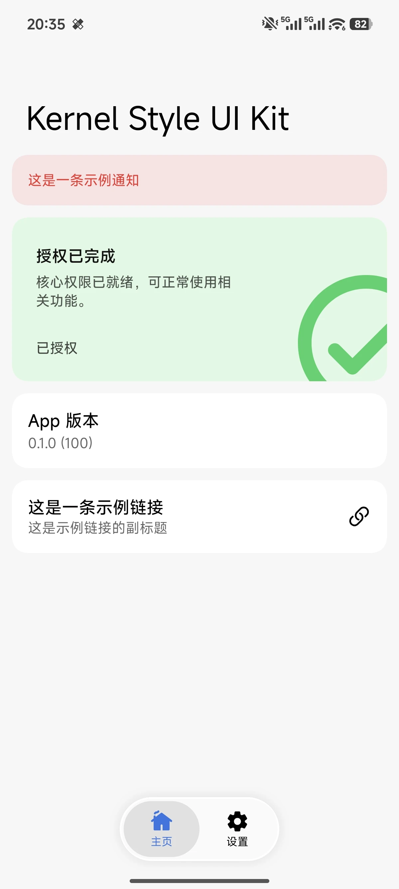
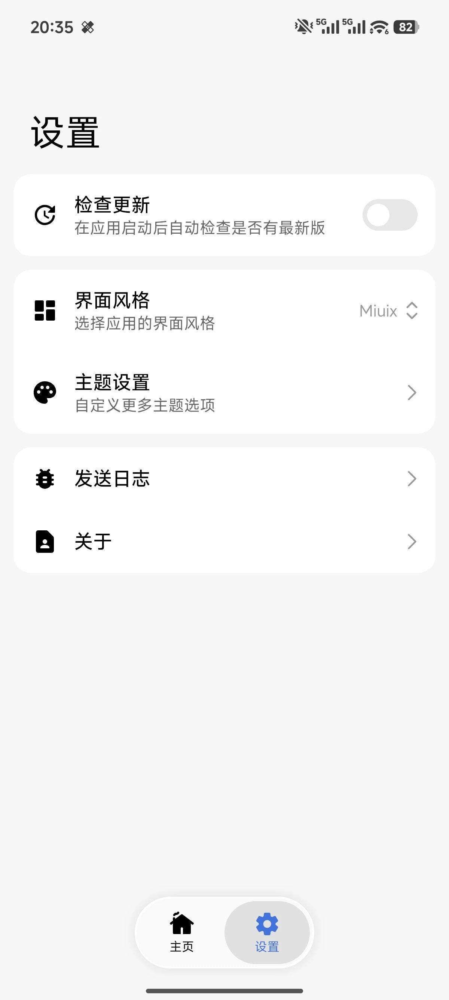
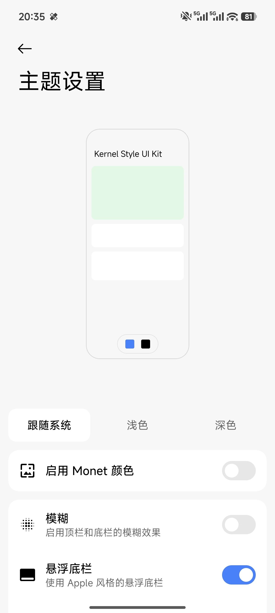
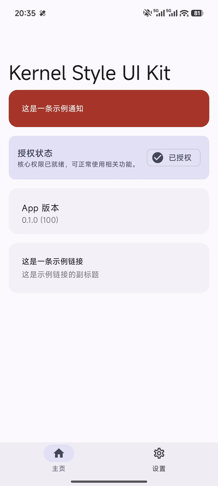
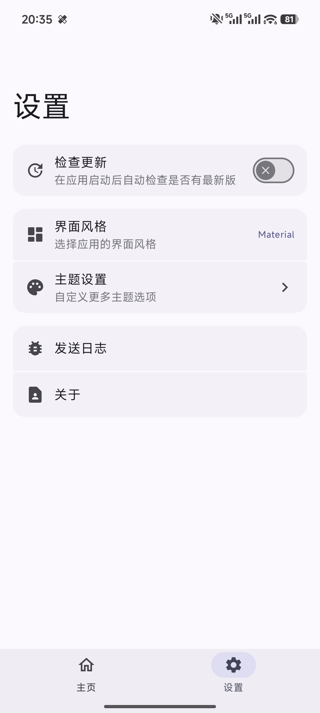
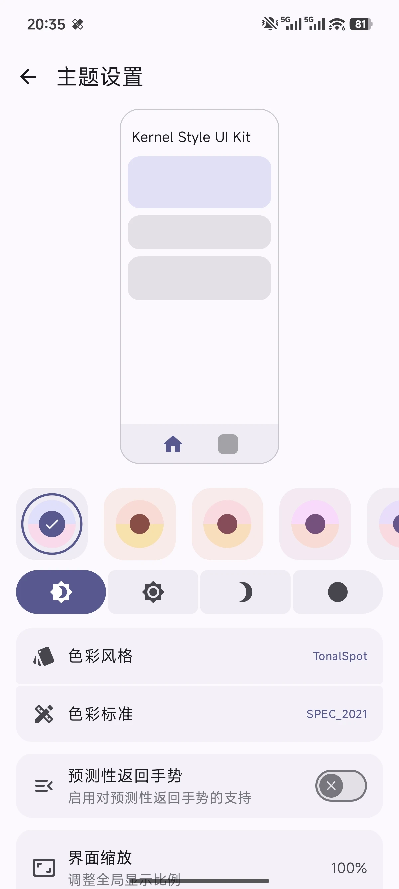

# Kernel Style UI Kit

English | [简体中文](README.zh-CN.md)

## Introduction

Kernel Style UI Kit is an Android UI template project extracted and reorganized from the visual style of KernelSU Manager.

The project keeps the original Miuix and Material interface styles while removing practical KernelSU functionality such as root access, module management, flashing, and superuser authorization. It is intended as a reusable UI starter template for Android open-source apps, allowing developers to replace the business logic, update branding, and continue building on top of it.

Currently retained practical features include:

- Update checking
- Log sharing
- Automatic language switching
- Miuix / Material theme switching

## Screenshots

| Miuix Home | Miuix Settings | Miuix Theme Settings |
| --- | --- | --- |
|  |  |  |

| Material Home | Material Settings | Material Theme Settings |
| --- | --- | --- |
|  |  |  |

## Usage

1. Clone the project:

```bash
git clone https://github.com/chenaizhang/Kernel-Style-UI-Kit.git
cd Kernel-Style-UI-Kit
```

2. Open the project with Android Studio and wait for Gradle sync to finish.

3. Update the basic app information for your own project:

- `applicationId`, `namespace`, and version information in `app/build.gradle.kts`
- App name and text resources in `app/src/main/res/values/strings.xml`
- Icon assets in `app/src/main/res/drawable` and `app/src/main/res/mipmap-*`
- Update-check URL and About page links

4. Build the debug APK:

```bash
./gradlew :app:assembleDebug
```

5. For release builds, create your own signing configuration based on `sign.example.properties` and fill in real keystore information. Do not commit real signing files or passwords to the repository.

## Discussion

Please use GitHub Issues for bug reports, feature suggestions, and template usage discussions.

When opening an Issue, please include as much context as possible:

- Device model and Android version
- UI mode used, Miuix or Material
- Steps to reproduce
- Screenshots or logs

## License GPL3

This project is released under the GNU General Public License v3.0. See the `LICENSE` file in the project root for details.

## Acknowledgements

Thanks to the KernelSU Manager project for the original UI foundation and open-source reference.

Thanks to Miuix, Jetpack Compose, Material Design, and the related open-source ecosystem.

Thanks to all developers who provide feedback, open Issues, and help improve this template.
